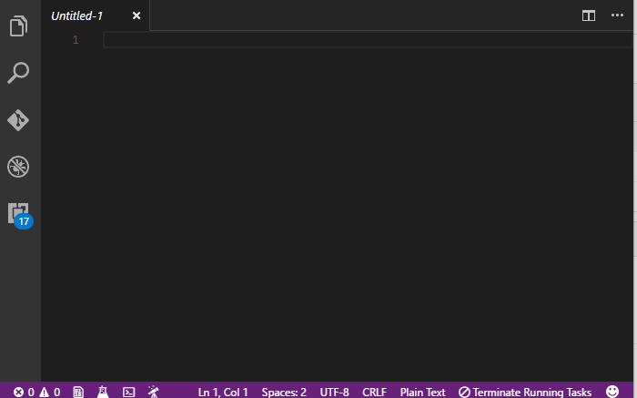

# sql-beautify

VS Code extension that beautifies SQL using the [vkbeautify](https://www.npmjs.com/package/vkbeautify) module.

## Features

Beatify your SQL!  Make sure the language is set to `SQL` and press `Alt+Shift+f` just like you normally would.

## Release Notes

### 0.0.1

Initial release

